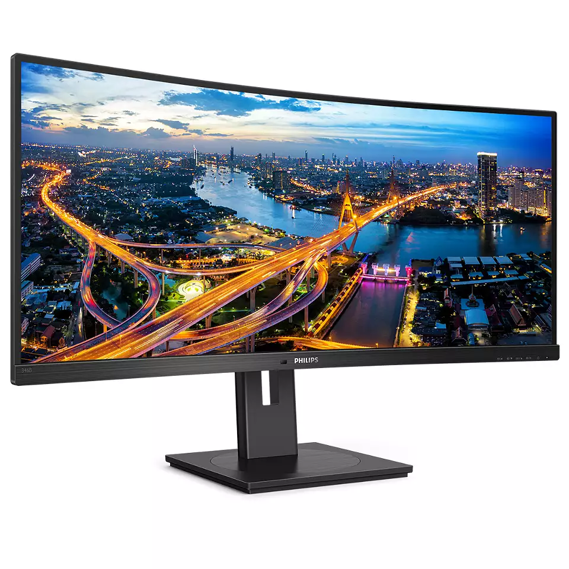
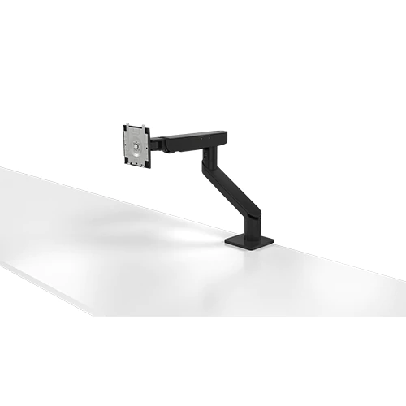

---

title: 'My Productivity Desk Setup for 2024'

date: '2023-11-30T09:00:00+01:00'

author: 'Dara Oladapo'

excerpt: ''

permalink: '/2023/11/30/productivity-desk-setup/'

image: ''

categories:
    - 'Devices and Gadgets'
    
---

# Introduction

I have been working from home since around the time COVID started and I have been trying to make my desk setup as productive as possible. I have been able to achieve this by using a combination of hardware and software. I will be sharing my setup with you in this post.

One of the major things to note in my setup is that I have grown into it and I did not get all the devices I use in one day or one month. I have been able to get them over time and I am still looking to improve on it.

I have two desk setups which I use. My primary setup which I use for extensive work and enables me to be fit as I work - I'll get to it in a bit. And the secondary setup is for recording and sort of a backup station.

# Primary Setup
I have a primary setup which I use for my day to day work. This setup is what I use for my day to day work, video editing, and any work that needs the major computing power of the desktop PC i have there. 

## Desk
I have a sit-stand desk from a brand called `Flamaker` which I mostly use in standing mode. It is 160cm by 80cm wide and comes with castor wheels for ease of moving around if I so need it - which I do a lot because I move my setup around many times a year to just have a new feel of the room. It has  4 programmable modes which helps me just get a desired height without much. I decided to get this desk to save my back as I work and also to be able to move around while working. I have been able to achieve this with this desk.

Underneath the desk,  I have a `Cable Management Tray` from a brand called `Starttech.com` which helps me keep my cables tucked and also helps me move the desk around without having to worry about the cables getting tangled. I also have a couple of velcro straps, cable clips, and cable ties to help me keep the cables in place. To pass long cables between sitting and standing modes - because I have my desktop PC on the ground, I have a `Cable Management Sleeve` which helps me pass the cables through and clean. It's not the sweetest looking cable management, but it works for now.

| Key Point | Value/Comment |
|----------|----------|
|  Usability  | ⭐⭐⭐⭐☆ |
|  In Use since  |  May 2023  |
|  Cost at purchase| £239.00 |
|  Purchase Link (UK)  |   |
|  Purchase Link (US)  |   |
|  Personal Rating |  ⭐⭐⭐⭐☆ |

## Monitors

For my display, I use a quad monitor setup that consists of:

1 Philips 346B1C 34" Curved UltraWide Monitor: this is where I do most of work from coding to video editing, and any work that requires huge screen real estate. It supports HDMI, Display Port and USB-C display options. If you're using the USB-C option, you can extend your computer's IO with the additional 4 USB ports to the left side of the monitor. It also has a built-in KVM switch which allows you to connect two computers to the monitor and switch between them with the press of a button supporting Picture in Picture and Side-by-side modes for two connected computers. I use this monitor for my main work and it's great. I have it in the a little bit to the side of my desk for now It's a great monitor and I love it.

| Key Point | Value/Comment |
|----------|----------|
|  Usability  | ⭐⭐⭐⭐☆ |
|  In Use since  |  August 2023  |
|  Cost at purchase|  £320.00 |
|  Purchase Link (UK)  |   |
|  Purchase Link (US)  |   |
|  Personal Rating |  ⭐⭐⭐☆☆ | 

2 HP 24" FHD IPS Monitors: One in landscape mode for secondary or reference coding, viewing browser tabs, meetings, screen sharing (because you know, not everyone uses an ultra-wide) and links to the main work I am on. 
The other in a flipped portrait mode for reading and consuming mainly docs and references while working. Sometimes, i have my chat windows on there.

| Key Point | Value/Comment |
|----------|----------|
|  Usability  | ⭐⭐⭐⭐⭐ |
|  In Use since  |  September 2020  |
|  Cost at purchase |   £110.00 each |
|  Purchase Link (UK)  |   |
|  Purchase Link (US)  |   |

1 EVICIV 16" Portable Monitor: This also serves as my mobile monitor whenever i'm on away from the house and need a secondary display. It's light, it's great and gets the job done for me.
When I'm doing code, cloud or DevOps work, I use it to display my terminals and other tools I need to get the job done. And when I'm doing video editing, I use it to display my assets folders, scripts and tasks.

| Key Point | Value/Comment |
|----------|----------|
|  Usability  | ⭐⭐⭐⭐☆ |
|  In Use since  |  May 2023  |
|  Cost at purchase|   £169.00 |
|  Purchase Link (UK)  |   |
|  Purchase Link (US)  |   |

## Monitor Arms
3 of the monitors on my desk are mounted up on 2 monitor arms to provide versatility of movement of adaptation for my setup.

The first one is the Dell MSA20 which holds the 34" Philips monitor and can hold up to 38" monitors. It has a great range of motion, a counter-balance system for heavy monitors and can be adjusted to any position I want. It also has a cable management grove in-built that helps me keep the cables in place. It's a great monitor arm and I love it so far since getting it.

| Key Point | Value/Comment |
|----------|----------|
|  Usability  | ⭐⭐⭐⭐⭐ |
|  In Use since  |  November 2023  |
|  Cost at purchase|   £127.00 |
|  Purchase Link (UK)  |   |
|  Purchase Link (US)  |   |

## Laptop Stand

## Laptops

## Tablet

## Desktop PC

## Keyboard

## Mouse

## Headsets

## Webcams

## Microphone

## Speaker

## Docking Station

## USB Hub

## HDMI Switch

## Monitor Stand

## Audio Interface

# Secondary Setup

# Conclusion