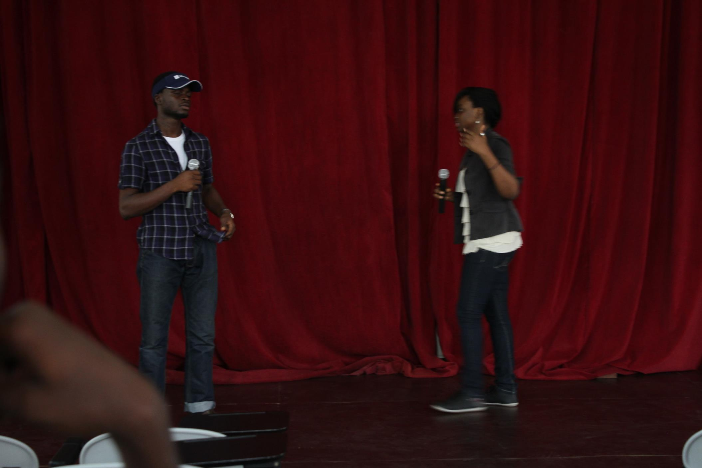
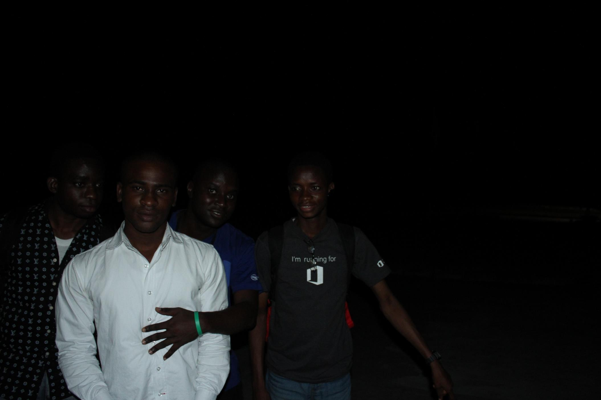

---

title: 'MSP Nigeria Onboarding 2014'
date: '2014-12-21T15:15:00+00:00'
author: Dara Oladapo
excerpt: 'It was the MSP Nigeria Onboarding event for 2014. In case you’re curious MSP stands for Microsoft Student Partners. This is a group of smart young individuals who are passionate about technology and have influence to pass their knowledge on to others in many ways. Sincerely, these are one of the coolest set of people you can be friends with.'

permalink: /2014/12/21/msp-nigeria-onboarding-2014/

categories:
    - General
    - 'News and Updates'
---

This past weekend was fun for me at [Elizade University](http://elizadeuniversity.edu.ng), Ilara-Mokin, Ondo State, Nigeria.

  

It was the MSP Nigeria Onboarding event for 2014. In case you’re curious MSP stands for Microsoft Student Partners. This is a group of smart young individuals who are passionate about technology and have influence to pass their knowledge on to others in many ways. Sincerely, these are one of the coolest set of people you can be friends with.

# Day 1

## 12th December 2014

Arrival and the converging point was [The Federal University of Technology, Akure](http://futa.edu.ng) (FUTA for short). MSPs from all around Nigeria started coming in at about 11:35am till evening time. We were gathered and shared experiences and insights into the MSP program from new to old member and got to know each other more. Yeah, basically.

### Evening time

Evening time was time to move to our host university. It was a fun ride for all.

 

Everyone got lodged into the hostels and we went on to the faculty building to stat for the night. It was a night of introduction basically.

 

# Day 2

   

## 13th December 2014

After a good night rest, we got back to the faculty building to get started for day 2. We got started about our roles as MSPs, how to get better at what we do and share the good news which we have heard of.

                          

We had Joel, Kendra, Shina and Ade talk to us and it was really inspiring to see the passion they have for their work and to make lasting impact.

It was fun day 2.

After all said and done for the day, it was time to retire for the night.