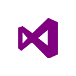
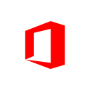
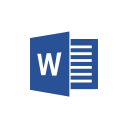
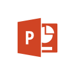
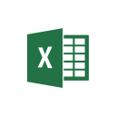
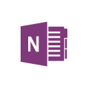
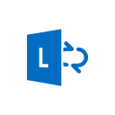

---

title: 'My Favorite Tools'
date: '2016-09-30T14:38:00+01:00'
author: Dara Oladapo
excerpt: 'As a core developer, this has been my major tool as it is the first thing I install on any of my new machines or after a clean OS install. I have used from Visual Studio 2010 to Visual Studio 2015. I once had the setup Visual Studio 2005 and 2008.'

permalink: /2016/09/30/my-favorite-tools/

categories:
    - 'Software Development'
---

I have been known over the years to be a lover of Microsoft and their products. Practically, all my tools and development skillset are targeted towards Microsoft Technologies.

This post is to share some of my favorite tools with you and possibly links to download them (the downloadable ones).

# Microsoft Visual Studio

As a core developer, this has been my major tool as it is the first thing I install on any of my new machines or after a clean OS install. I have used from Visual Studio 2010 to Visual Studio 2015. I once had the setup Visual Studio 2005 and 2008.

A senior colleague once said

Visual Studio is the World’s best IDE

  

## What I love about Visual Studio

- It brings together all your development into one interface
- Installation is easy and straightforward
- You can download and use extension straight from the software making you to concentrate on your work
- It is the best IDE I have ever used and I have many friends who also love it
- SDKs that use Visual Studio are integrated into the environment making the developer’s life easy
- Smart and Easy-To-Use Intellisense
- Great and Effective Debugger Tools
- Helpful help and documentation
- I can develop for Windows, Android and iOS from inside Visual Studio
- Powerful and fast emulators for Windows and Android
- Cloud Explorer (I can access my Azure services from inside Visual Studio)
- I can easily deploy Websites and Apps to the Cloud from inside Visual Studio.

## Getting Visual Studio

### For Independent Developers

If you wish to use a free version of Visual Studio, you can download the Community Edition of Microsoft Visual Studio from [Visual Studio Website](http://visualstudio.com).

With this, you can develop, test and publish your applications free of charge.

### For Students

Visual Studio Professional is available as a free download to students through the Microsoft [DreamSpark](http://dreamspark.com) Program.

### For Professionals and Enterprise Developers

You can download the Professional or Enterprise Version of Visual Studio from [Visual Studio Website](http://visualstudio.com).

If you have an [MSDN](http://msdn.microsoft.com)/[Technet](http://technet.microsoft.com)/[BizPark](http://bizpark.com) Subscription, you can get the different versions of Visual Studio from your Subscriber Downloads Portal.

For compatibility questions, click [here](http://www.visualstudio.com/en-us/products/visual-studio-2013-compatibility-vs.aspx)

# SyncFusion Metro Studio

This is another great tool I have grown to love. I use it do design icons for my programs and it has been a very cool tool for me to use over time.

In fact, all the icons in this post were designed using Metro Studio.

It’s a free software, you can download from [SyncFusion Website](http://syncfusion.com/metrostudio).

# Microsoft Office

     

This productivity tool from Microsoft has helped me a lot as a student, developer, trainer and geek.

I prepare my documents, presentations and even videos with Microsoft Office.

The major components of the suite I use a lot are Word, PowerPoint, Excel and OneNote.

I have these apps pinned to my taskbar for easy access.

## What I love about Microsoft Office

- I get to sign in with My Microsoft Account, this give me access to my documents on the [Cloud](http://onedrive.live.com).
- My most recent documents on any of my devices are placed in clear sight when I open Microsoft Office.
- I create my blog posts with Microsoft Word and I publish straight from inside Word
- Plugins (my favorite Office plugin is Wikipedia and Dictionary)

You can download Microsoft Office from [Microsoft Office Portal](http://office.microsoft.com).

# OneDrive

For someone who has multiple devices, always on the move and loves productivity. OneDrive is a great tool for me to work on my files across all my devices.

I can start a document on my PC, edit part of it on my phone and finish up on my tablet.

I use OneDrive mostly on my PC, Android and Windows 10 Mobile Device. I am always on the go with all of my documents.

Saving your document e.g. in Microsoft Word on my PC and saving it to OneDrive, I get it on my tablet as the most recent file when I open up Word on it.

This makes life easy and enhances my productivity.

# Windows Phone

December 2012, I got my Nokia Lumia 610. I was happy at my very first Windows Phone. My goal for buying it was to ‘feel like a Windows Phone Developer’.

I had not written much for the Windows Phone as at that time simply because my PC wasn’t as powerful as to handle the emulator with enough efficiency. As soon as I got it, I got it unlocked and off I was into the Windows Phone App Development.

The first thing that whao-ed me about my Windows Phone was that on activation and sign-in with my Microsoft Account, all my contacts got synced automatically. Well, I didn’t know much then.

I got my favorite apps downloaded and off I was into the Mobile Productivity World. The camera of the phone was the best camera I had then.

By June 2013, I switched to the Lumia 720. This was a cool upgrade for me and I got along quite well with more productivity under my belt. Later on I used Lumia 630, 535, 550.

Currently, I own a Lumia 830 running Windows 10 Mobile (Insider) and Lenovo Vibe P1M (for dev purpose).

## What I love about the Windows Phone

Here are out of the box features for me that I don’t need to get an app to do it for me.

- Live Tiles
- Easy Sync
- Control Over Background Task
- Easy App Navigation
- Friendly Home Screen
- Power Conservation
- Roaming (simply put same settings and personalization across your devices)
- SMS Sync – I haven’t lost track of my SMS from way back since I got on Windows Phone.

These are my major favorite tools. I have a few more but these catch my fancy most.

Thank you for reading.