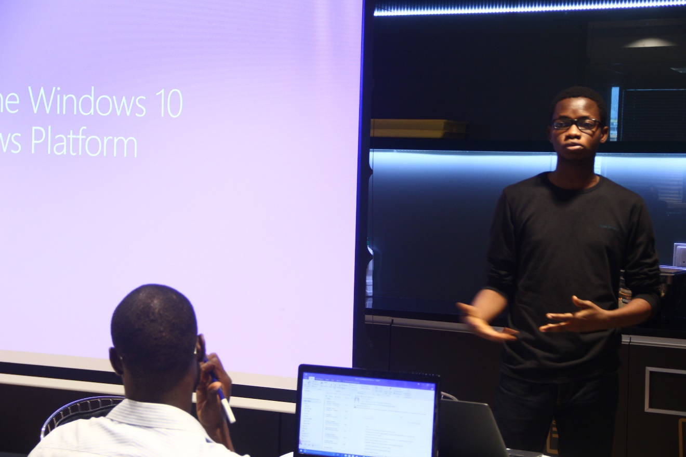
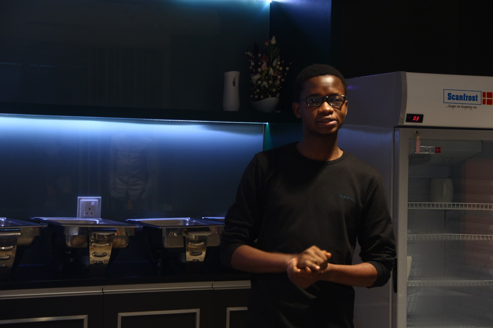
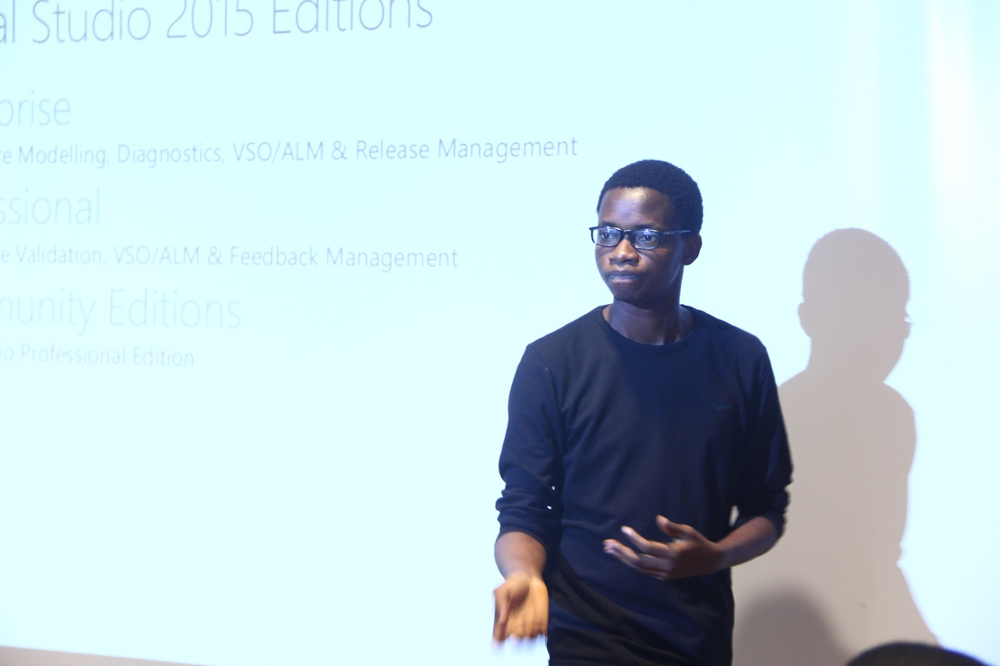
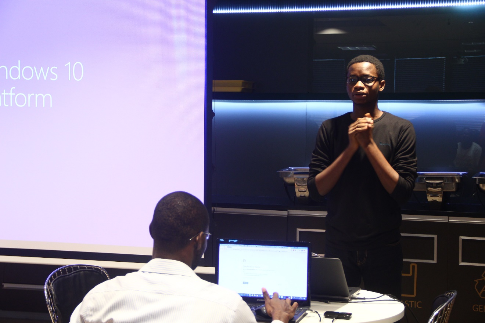

Yesterday, November 5, 2016, I had the privilege of speaking on Universal Windows Platforms Development at the Lagos .NET User Group Meetup.

I spoke to get attendees excited about developing Universal Windows Apps and here are a few highlights.

   

The PowerPoint Slide and Code Samples can be found [here](https://github.com/lagosdontnetusergroup/UWP-Samples).