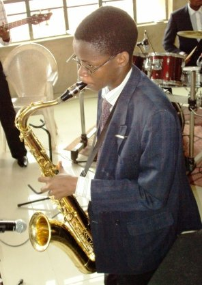
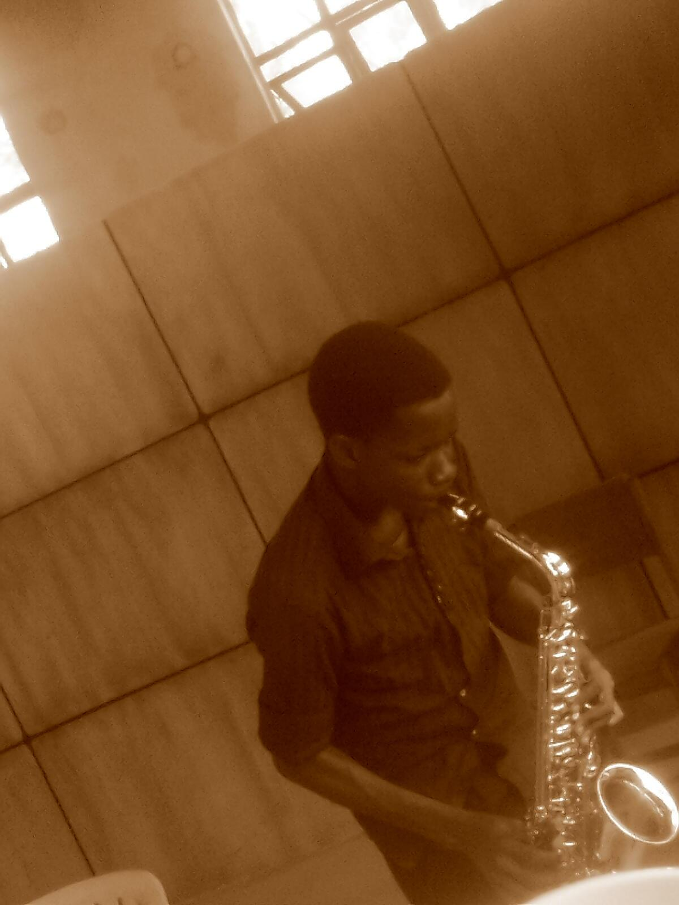

---

title: '10 years a Saxophonist'
date: '2020-01-01T07:32:00+00:00'
author: Dara Oladapo
excerpt: 'It was more like a stroke of luck for me starting to play. I remember my brother (Olusesan) coming home that Sunday in August 2009 and telling me “Dara, we just got a saxophone in church, would you like to play”. I had been playing the recorder for about 2 years (self-taught) then and had no clue how to play the saxophone.'

permalink: /2020/01/01/10-years-a-saxophonist/

categories:
    - General
---

Last year November made it 10 years since I have been playing the saxophone.

It was more like a stroke of luck for me starting to play. I remember my brother (Olusesan) coming home that Sunday in August 2009 and telling me “Dara, we just got a saxophone in church, would you like to play”. I had been playing the recorder for about 2 years (self-taught) then and had no clue how to play the saxophone. The following Monday, I enrolled in a music school (Tonic Solfa Music School).

Figure 1 First Sunday 2010

In November 2009 for the first time, I held the Premier England Tenor Saxophone.

Figure 2: Ifeoluwa – My Alto Saxophone

2 years after, I got my Alto Saxophone that I play for about 6 years.

Figure 4: Praise – My Soprano Saxophone

November 2016, I got my Soprano Saxophone (just for the purpose of doing one of the things I saw Kenny G do in this song – <https://www.youtube.com/watch?v=oHONFub5MPM> – it’s embedded somewhere at the end). I just told my wife this morning and she can’t wait.

I’ve been blessed to play alongside some of the best musicians: my blood brothers – Olusesan and Israel and my other brothers and sisters – John, Iretole, IyinOluwa, Iyanuoluwa, Oluwatosin, Moses Fayomi (True Moses), Dunsin Fatuase, Sam Omodiji, Akin Akinbuwa. I really cannot mention all.

I was just reflecting this afternoon on some of things I’ll love to do more of this year and ministering with my saxophone is surely one of them. I thought to share a few of my videos over the last couple of years with you. Be blessed.

- 2014 at FSF FUTA: [https://www.youtube.com/watch?v=xacPf-H26l8&amp;t=521s](https://www.youtube.com/watch?v=xacPf-H26l8&t=521s)
- 2014 at Fullstature Missions International: [https://www.youtube.com/watch?v=D4Kw-NDuQt8&amp;t=273s](https://www.youtube.com/watch?v=D4Kw-NDuQt8&t=273s)
- 2015 at FSF FUTA: [https://www.youtube.com/watch?v=GE\_a2dqKJAA](https://www.youtube.com/watch?v=GE_a2dqKJAA)
- 2017 at Imole Oluwa Baptist Church: <https://www.youtube.com/watch?v=yad1VR8VtDs>
- Rehearsal Mixes
- Oba Awon Oba – 2017: <https://www.youtube.com/watch?v=yad1VR8VtDs>
- Rising Above – 2017: [https://www.youtube.com/watch?v=pmm0Qy-\_kjI](https://www.youtube.com/watch?v=pmm0Qy-_kjI)
- Yahweh -Glorious God – 2017: <https://www.youtube.com/watch?v=zZAmrInnriQ>