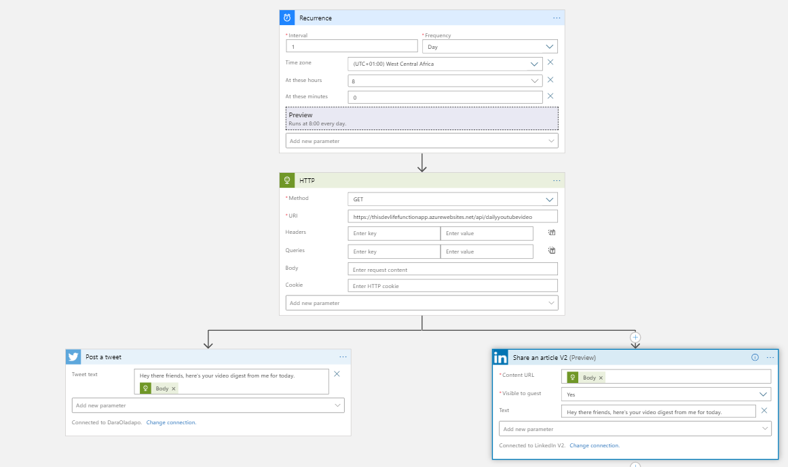
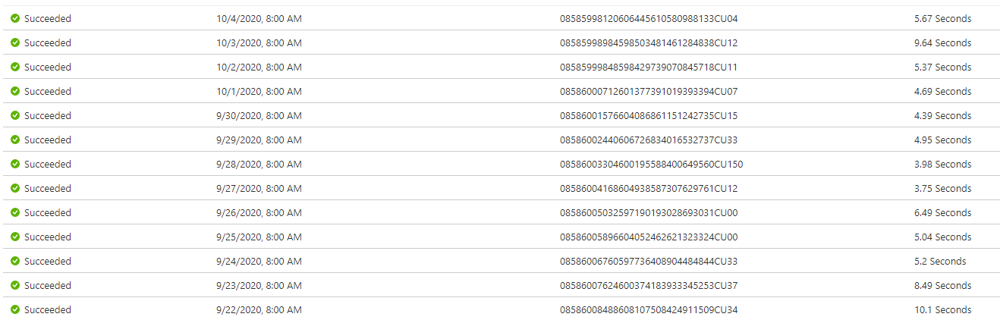
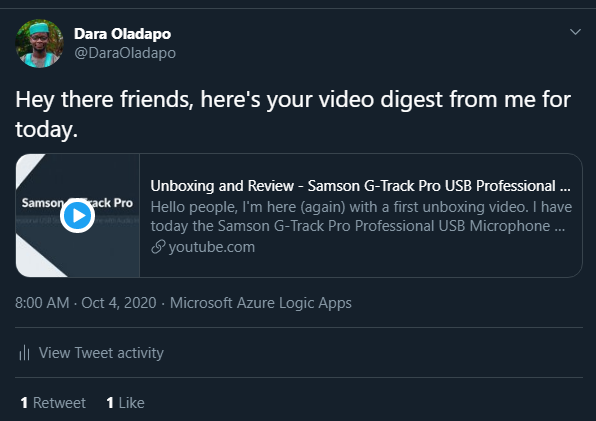

Hi there, for the past couple of weeks, I have been able to focus on some important things in life. Previously, I would wake up, check tweets, email notifications, etc and I realized I started missing out on being productive and later become overly busy.

I will share how I automated my mornings and now able to have a proper sleep routine.

I tried using some of the social automation apps and I just could not imagine paying such an amount every month to have my posts scheduled to go out every morning. Then I thought – I can code, I have the cloud, I have the content. Why not write a few lines of code to do this for you. Let me show you how.

Fun fact: this started out as me trying to make a website for my Podcast – [This Dev Life](https://anchor.fm/thisdevlife). I will drop links to any external tool used that isn’t mine – so watch out for them either in the post or at the end.

Here are the tools I used

- Azure Functions (C#)
- RSS Feed
- Azure Logic Apps

The process I used was the same for all the 3 contents I put out every morning – [podcast episode](https://anchor.fm/thisdevlife), [blog post](blog.daraoladapo.com) digest and [video](https://youtube.com/daraoladapo) digest.

### The code

I will just show how I did this for my YouTube Channel, the rest follow the same way but with different links and content.

Step 1: Getting the RSS Feed (for my YouTube Channel). Follow this [blog post](https://danielmiessler.com/blog/rss-feed-youtube-channel/) to learn how to do that.

This is mine. I set it in a list of constants.

public static string YoutubeFeedURL = “https://www.youtube.com/feeds/videos.xml?channel\_id=UCfDZF0pWhNjJO\_kpPozr8Tg”;

Step 2: NUGET. I am using a NUGET package called [FeedReader](https://www.nuget.org/packages/CodeHollow.FeedReader) from CodeHollow.

Step 3: Get Feed. Here, I use an HTTP Trigger function to get the RSS feed content using the NUGET package from Step 2. I then randomize to get 1 of the feed items using the Random() function. Lastly, I return this link.

public static class DailyYoutubeVideo

{

\[FunctionName(“DailyYoutubeVideo”)\]

public static async Task&lt;IActionResult&gt; Run(

\[HttpTrigger(AuthorizationLevel.Anonymous, “get”, Route = null)\] HttpRequest req,

ILogger log)

{

log.LogInformation(“Daily Youtube video requested.”);

var YouTubeFeed = await FeedReader.ReadAsync(Constants.YoutubeFeedURL);

var RandomVideoLink = YouTubeFeed.Items.ToArray()\[new Random().Next(YouTubeFeed.Items.Count) – 1\].Link;

log.LogInformation(“Daily Youtube video returned.”);

return new OkObjectResult(RandomVideoLink);

}

}

### The cloud

Now, all I need to do is get this up in the cloud to be hosted and connect the trigger to it. For this, I used a time-based Azure Logic App that runs 8:00AM every day, call the Azure Function HTTP endpoint.

Next step for me was to get the HTTP response body – which is a link to one of my videos and then I tweet it and post it to LinkedIn.

Image : Azure Logic Apps Visual Designer

### The result

Image : Azure Logic Apps Logs

Azure Logic Apps takes a log of every run that happens, so you can see how that progresses whether it runs successfully or fails.

Image : Tweet on October 4

Image : LinkedIn Post on October 4

As simple as that, I was able to ensure I get to what matters in the mornings while still getting content out to my audience.

Do you need to get started with this? you can check out the official documentation for the services below:

- Azure Logic Apps: <https://docs.microsoft.com/en-us/azure/logic-apps/>
- Azure Functions: <https://docs.microsoft.com/en-us/azure/azure-functions/>