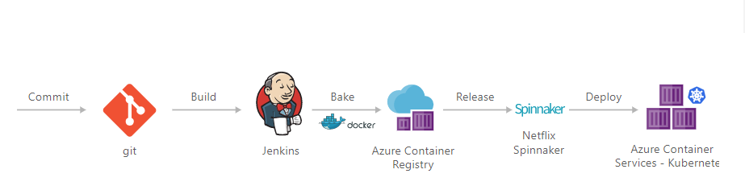
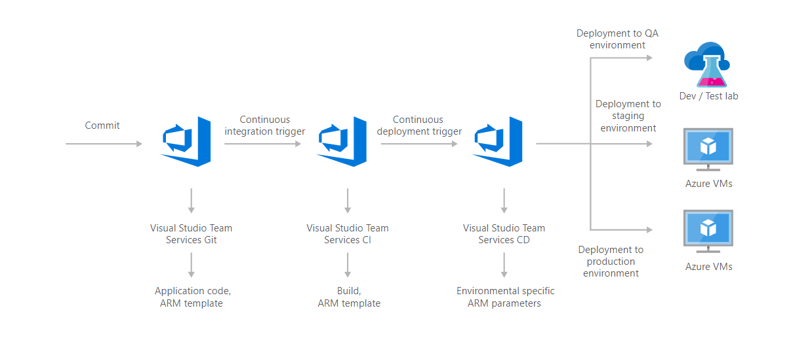
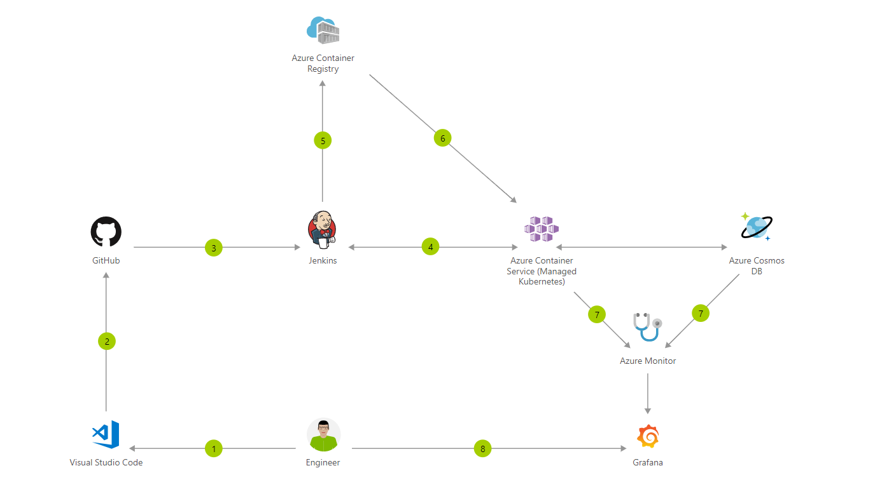
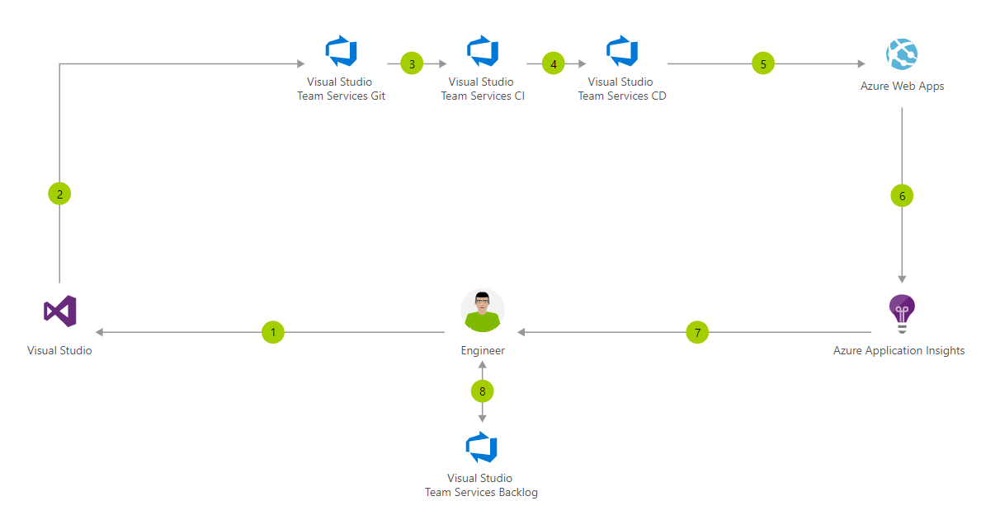
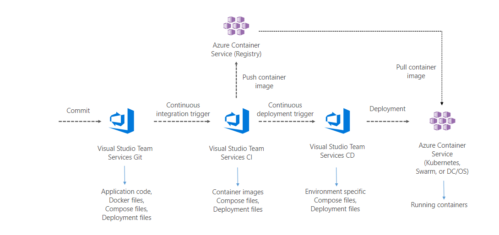
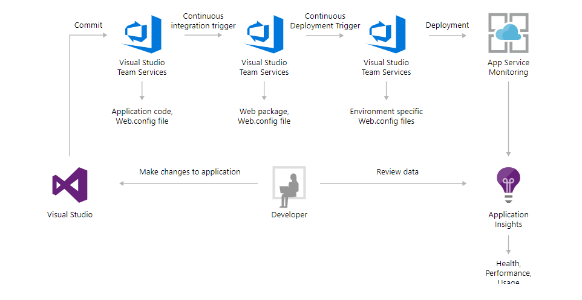
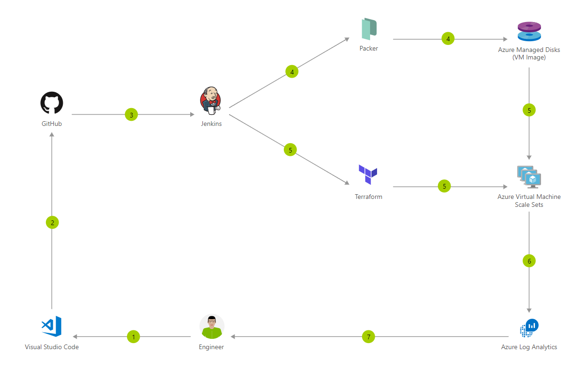

---

title: 'DevOps for Organizations'
date: '2021-09-14T13:24:00+01:00'
author: Dara Oladapo
excerpt: "It is no doubt that software and computers have come to be part of our everyday lives. There is an ever growing need to develop quality, efficient and robust solutions every day to meet the growing needs of customers.\n\nTo develop quality software that users love, there is the need to be agile and responsive to users’ feedback and support requests. Some of this responsiveness could be proactive or reactive."

permalink: /2021/09/14/devops-for-organizations/

categories:
    - DevOps
    - 'Software Development'
tags:
    - devops
    - 'devops for companies'
    - 'devops for organisations'
---

# Introduction

It is no doubt that software and computers have come to be part of our everyday lives. There is an ever growing need to develop quality, efficient and robust solutions every day to meet the growing needs of customers.

To develop quality software that users love, there is the need to be agile and responsive to users’ feedback and support requests. Some of this responsiveness could be proactive or reactive.

There exists quite a number of software development methodologies adopted by different developers and organizations depending on their business and technical decision makers. The most popular software development lifecycle methodologies are Waterfall, Prototyping, Extreme Programming, Agile.

Each of these methodologies have their benefits and shortcomings. Hence the need to have a framework that is optimized to meet business and user needs in a timely and cost-effective manner.

I would not dwell on explaining the different methodologies but would like to point out the features that stand out in each of the four I listed above and maybe a few more.

| Methodology | Feature | Shortcoming |
|---|---|---|
| Waterfall | Linear sequential approach of software development | Long stiff process |
| Prototyping | Making an early sample, model, or release of a system | Could be very costly and time wasting |
| Extreme Programming | Intended to improve responsiveness to changing customer requests | Prone to lots of errors and lack of structure |
| Agile | collaboration between self-organizing, cross-functional teams utilizing the appropriate practices for their context | Lack of emphasis on necessary designing and documentation |

The methodology in use by most modern organizations is the agile methodology because it proves to have the most flexible and user-centric approach to software development.

One point to note is that the need for DevOps arose from the increasing success of agile software development.

Agile Software Development

“Agile software development describes an approach to software development under which requirements and solutions evolve through the collaborative effort of self-organizing and cross-functional teams and their customer(s)/end user(s). It advocates adaptive planning, evolutionary development, early delivery, and continual improvement, and it encourages rapid and flexible response to change.”

*Source: Agile software development –* [*https://en.wikipedia.org*](https://en.wikipedia.org/wiki/special:search/Agile%20software%20development)

# What is DevOps

DevOps (derived from two words- development and operations) is a software engineering culture that aims to bring to union Software Development and Operations. DevOps’s strong features is to strongly bring into scope the automation and monitoring of all the steps of Software Development from Inception to release and even integrating a monitoring and feedback chain for future updates and bug fixes on these software solutions.

DevOps aims at shorted development lifecycle, increased deployment frequency and more dependable release in close alignment with business objectives.

DevOps cuts across the different stages of software development and teams of stakeholders as it hinges on 3 main components: People, Process and Product.

# The DevOps Toolchain

Let us highlight one of the many interpretations of the DevOps toolchain

1. Code
2. Build
3. Test
4. Package
5. Release
6. Configure
7. Monitor

# One Goal, Different Methods

While there are numerous mechanisms for modelling DevOps one of the most effective techniques is that of monitoring value stream mapping. This model is a way to help businesses identify their organizational silos, existing processes, and toolsets and improve upon each of them. Each aspect of the system from the end user to the business itself is mapped and identified.

Below are some of the solution architectures scenarios for modelling DevOps (Microsoft DevOps):

Continuous integration and deployment (CI/CD) for containers with open-source software (OSS)

Continuous deployment for Virtual Machines with Visual Studio Team Services

Container CI/CD using Jenkins and Kubernetes on Azure Container Service (AKS)

CI/CD for Azure Web Apps

Continuous integration and deployment (CI/CD) for containers with Visual Studio Team Services

Continuous integration and deployment (CI/CD) for Azure Web Apps with Visual Studio Team Services

Immutable Infrastructure CI/CD using Jenkins and Terraform on Azure Virtual Architecture overview

# Conclusion

DevOps is a practice that is untapped yet and implanting these practices in organizations will be a huge time and cost saving for them.