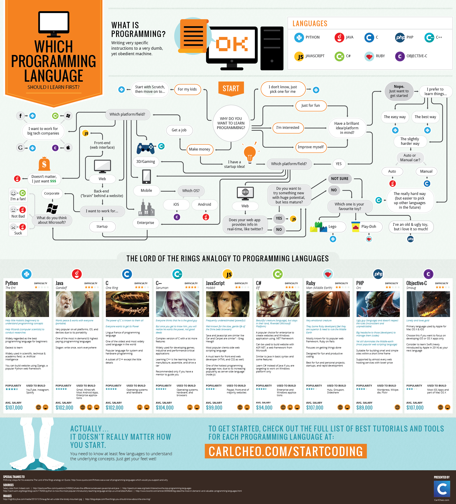

In one of my most recent posts, I introduced you to the [\#HourOfCode](http://code.org).

This post is to get you started with going DeepDive or JumpStart into the programming world. My personal experience in the programming world has been fun and interesting. In this post, I will be using the word **CODING** and **PROGRAMMING** interchangabely.

# What is Coding?

Coding is an act of writing (typing actually) computer instructions in a language (that the computer understands) to perform specific tasks.

There are a couple of Languages you can decide to learn.

So if you love to create, write, explore and have fun, coding is one of the those things you might wanna take on. I started my programming journey about 5 years back and I am really glad I did make that choice.

# Where to Learn

There are quite a number of places online where you can learn programming. There are free and paid ones.

I’m gonna give you those ones that I have personally visited and benefited from.

You can always you use your favorite search engine to find out more.

- Microsoft Virtual Academy
- Codecademy.com
- Code.org
- LearnVisualStudio.NET
- Channel9.msdn.com
- And a whole lot more.

# What Language to take on

I wouldn’t tell you one particular language to learn.

What I’ll do is tell you some of the languages you can learn and find out about them and select your preferred choice (or choices)

- C#.NET
- VB.NET
- PHP
- C
- ASP.NET
- HTML, CSS and JavaScript (well, just because they go hand in hand)
- Python
- Ruby
- SQL
- Many many more exist than I can list and not bore you.

But take a look at the infograph below

From <http://www.best-infographics.com/programming-language-to-learn/>

