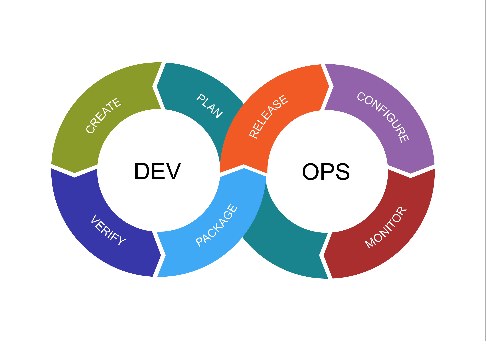
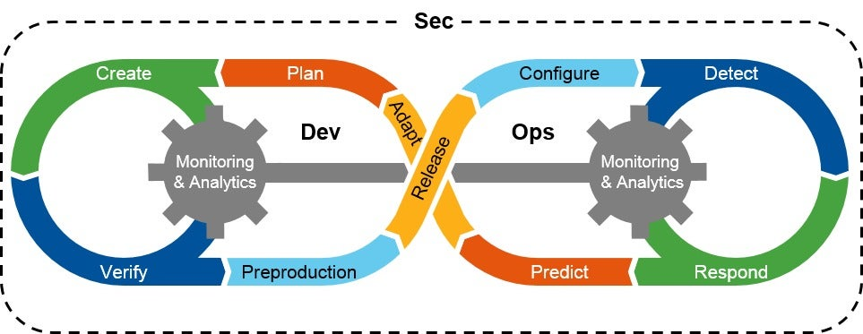

Let us talk about the intersection of Software Development, IT Operations and Security today.

The usual DevOps cycle goes like below. Read about [DevOps for Organizations](https://daraoladapo.com/stg_34b49/devops-for-organizations/).

But as a growing concern, security needs to be baked into every stage of the DevOps process. In the process of automation, we do not want to leave gaps for attackers, we want to give the right kind of approvals for deployment so we can deliberately deliver secure solutions to end user.

When you start thinking about security from the onset, your coding style, testing, deployment tasks become fool proof and you would experience less incidents from attacks.

## The stages of Software Development

Let us delve into each stage of the Software Development Life Cycle and see how you can integrate security operations into them.

1. Requirement Gathering and Analysis: at this stage of gathering requirements for your solutions, you analyse possible security risks, loopholes and try to figure out how to mitigate those risks further down the line.
2. Designing: This part of architecting the solution, designing flowcharts and UMLs, you would want to integrate approval flows, ensuring that only individuals who need access to the system and design your project around that.
3. Coding: You sure do not want to hard code API Keys and secrets into your code, you would want to use environment variables, secrets storage services like Azure Key Vault in the cloud and your CICD tools.
4. Testing: For your automated tests, you would plug in application security testing tools like Checkmarkx. These tools help you find issues and errors that may potentially put your application at risk.
5. Deployment: Before getting your apps out on the servers, you would want to do some penetration testing in a QA environment before pushing live.
6. Monitoring: after you have deployed the secured app to the live environment, you want to continuously monitor and check for issues.

There is this great article on what DevSecOps ([What Is DevSecOps and How To Implement It](https://nightfall.ai/what-is-devsecops-and-how-to-implement-it)) is and how you can start implementing it on your projects. Link [here](https://nightfall.ai/what-is-devsecops-and-how-to-implement-it).

Security is everyone’s responsibility when it comes to software development. Welcome to DevSecOps.