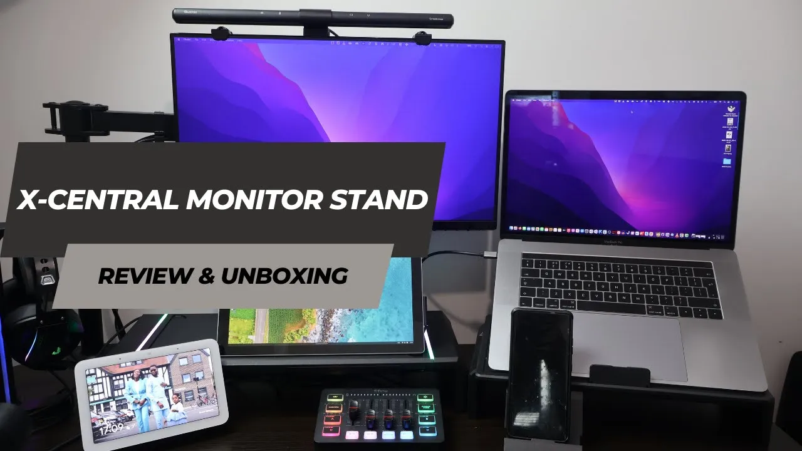

---

title: 'Revamp your workspace with the X-Central monitor stand and desk organizer'

date: '2023-12-09 06:00:00'

author: Dara Oladapo

excerpt: 'If you work on a laptop or desktop computer, you know how important it is to have a good desk setup that's usable and ergonomic with your screens at the right height with enough space to work with.'

categories:
  - 'Reviews'

tags: 
  - 'x-central'
  - 'monitor stand'
  - 'desk organizer'
  - 'desk setup'
  - 'workspace'
  - 'ergonomic'
  - 'desk accessories'
  - 'x-central monitor stand'
  - x-central monitor stand review'

image: '../../_posts/blog-assets/2023/12/x-central.webp'

permalink: '/reviews/revamp-your-workspace-with-the-x-central-monitor-stand-and-desk-organizer/'
    
---

If you work on a laptop or desktop computer, you know how important it is to have a good desk setup that's usable and ergonomic with your screens at the right height with enough space to work with. And of course, if you're someone who likes to keep things tidy, you'll want to have a good desk organizer to keep your desk clutter-free with easy access and power to your most used items. The X-Central Monitor Stand Space-Master Desk Organizer is a great solution for both of these needs, and I'll be telling you all about it in this review.

## What's in the box

- 2 monitor stands
- 1 data cable
- 1 charging cable
- After-sales service card
- User manual
- Information card
  
## Review

| Key Point | Value/Comment |
| --- | --- |
| Usability | ⭐⭐⭐⭐⭐ |
| In Use since | November 2023 |
| Cost as at December 2023 | $99.99 |
| Purchase Link (Direct - 10% Off) | https://bit.ly/x-central |
| Personal Rating | ⭐⭐⭐⭐☆ |

## Conclusion

The X-Central Monitor Stand Space-Master Desk Organizer is an exceptional product that I would wholeheartedly recommend to anyone in search of a reliable and efficient desk organizer. Its construction is robust and well-executed, ensuring that it will stand the test of time even under heavy use. The design is not only practical but also aesthetically pleasing, making it a great addition to any workspace.

One of the standout features of this product is its ease of assembly. The instructions provided are clear and straightforward, making the setup process a breeze even for those who aren't particularly handy. Once assembled, the product is incredibly user-friendly. It's designed with the user's convenience in mind, making it easy to keep your workspace tidy and organized.

The only potential drawback of the X-Central Monitor Stand Space-Master Desk Organizer is its price point. It's a bit on the expensive side compared to other desk organizers on the market. However, when you consider the superior quality and functionality that this product offers, it becomes clear that it's well worth the investment. This is not just a simple desk organizer; it's a tool that can significantly enhance your productivity and make your workday much more manageable. Therefore, despite its higher price tag, I believe that the value it provides makes it a worthwhile purchase.

